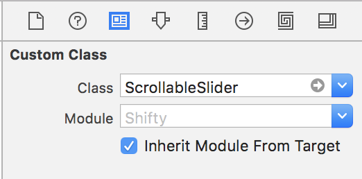

# Scrollable-NSSlider
`ScrollableSlider` is a subclass of NSSlider that accepts input from scrolling events. Apple doesn't support this natively, so this subclass was created to allow for scrolling input.

`ScrollableSlider` supports vertical, horizontal, and circular NSSliders. It also accounts for natural scroll direction, so you'll be scrolling in the right direction regardless of your settings.

# How to implement
1. Add the [ScrollableSlider](ScrollableSlider.swift) class to your code.
1. For any slider you want to operate with scrolling input, select it in Interface Builder and set the custom class to ScrollableSlider.
1. Scroll!

